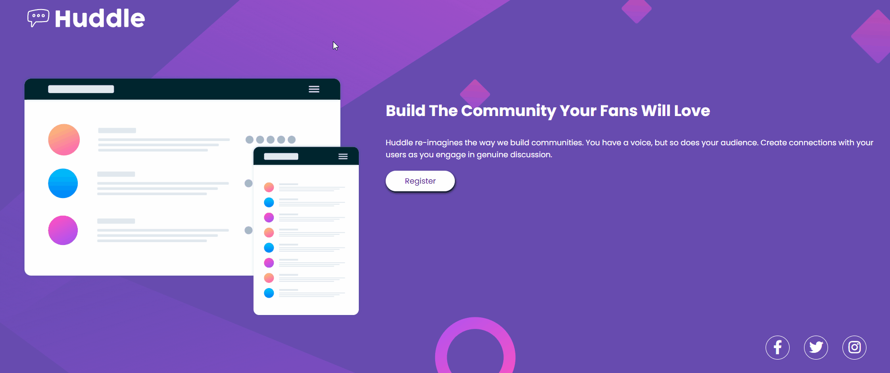

# Projeto de Landing Page (Huddle)
Um Projeto visual de uma landing page. Desafio HTML + CSS.

[]

## Linguagens Utilizadas 💻
- HTML; 💻
- CSS; 🎨

## Desafios e Objetivos 🚀
Colocar em prática ensinamentos sobre HTML e CSS;
Finalizar o desafio para conclusão dos módulos de HTML e CSS.

### Autor 🧑🏻
Rafael Cardoso dos Santos
